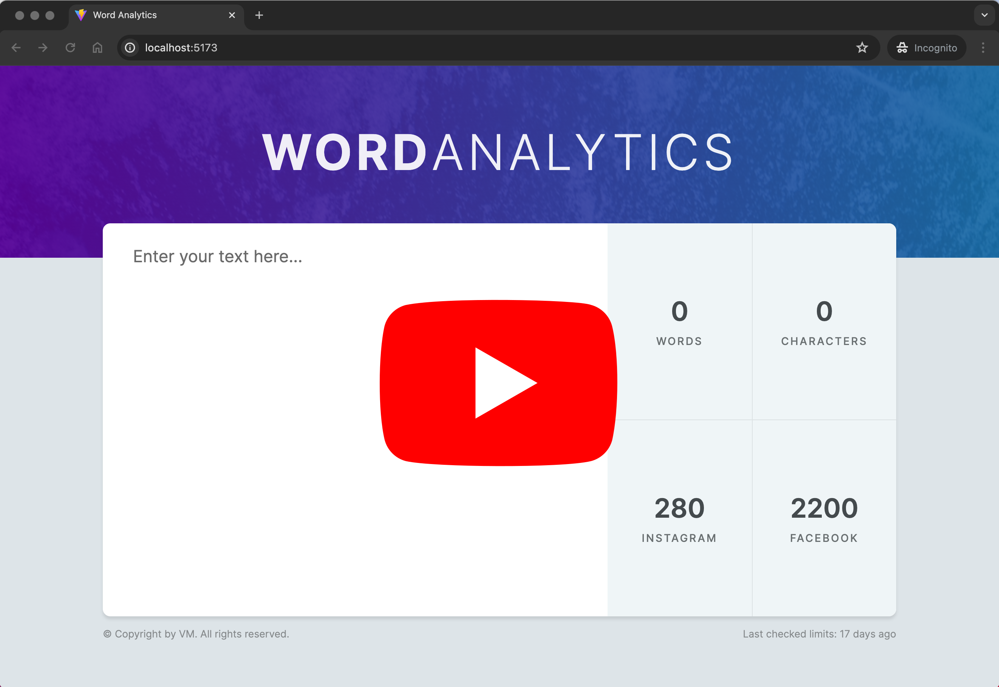

# Word Counter Web App

Welcome to the Word Counter Web App! This intuitive application allows you to quickly analyze text to track various metrics such as the total number of characters, words, and the proximity to social media platforms' character limits. This guide will provide you with all the necessary details to get started with this app.

[](https://youtu.be/nsbUlntz1dA)

## Features

- **Character Count**: Instantly view the total number of characters in your input text.
- **Word Count**: Track how many words are in your text.
- **Facebook Character Limit**: Displays how many characters you can still add before reaching the 63,206 character limit for a Facebook post. If the limit is exceeded, the count turns red.
- **Instagram Character Limit**: Shows how many characters until the 2,200 character limit for Instagram captions is reached or exceeded. Exceeding this limit also turns the count red.
- **Input Validation**: Ensures that your text does not contain potentially harmful scripts (e.g., `<script>` tags).

## Prerequisites

Before you begin, ensure you have the latest version of [Node.js](https://nodejs.org/) installed. This project uses Node.js 20.x or later.

## Installation

To get the project running on your local machine, follow these steps:

1. Clone the repository:
   ```bash
   git clone https://github.com/your-username/fancy-counter-app.git
   cd fancy-counter-app
   ```
2. Install the dependencies:
   ```bash
   npm install
   ```
3. Start the development server:
   ```bash
   npm run dev
   ```

This will launch the Vite development server and automatically open the app in your default web browser. The default URL http://localhost:5173/

## Building for Production

To build the application for production, use the following command:

```bash
npm run build
```
